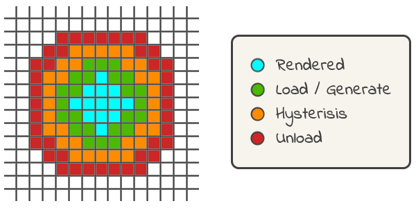

# Coordinate space

Right-handed coordinate system with:
```
    +Y = up
    +X = east
    +Z = south
```


# Chunk Cache Management



The world around the players is divided into zones. These zones look like a set of concentric rings when visualised but their construction follows a model of cellular automata where the zone a chunk belongs to depends on the zones of all of its neighbours.

Any chunks within the player's view distance are in the _render zone_. These chunks have render meshes built and the simulation updates these chunks every tick.

Any chunks which neighbour the rendered zone are in the _load zone_. As the player explores the world chunks which enter the load zone are forced to be loaded from disk or generated.

Any chunks which neighbour the load zone (on the outer edge) are in the _hysterisis zone_. Chunks which are in the hysteris zone and have been loaded or generated are kept in memory, but these chunks are not forced to be loaded or generated if they are not in memory. The purpose of the hysterisis zone is to prevent "thrashing" of the loaded chunk cache when the player crosses backwards and forwards over a chunk boundary. Imagine the player is standing at the edge of a chunk and moves forward - as she crosses the chunk boundary a new chunk will move into the load zone and the game will load the chunk into memory. If she then immediately moves backwards into the starting chunk then the chunk which was just loaded will move out of the load zone. With no hysterisis zone the chunk would immediately be unloaded. If she then moved forward again the chunk would have to be reloaded, etc. By adding the hyterisis zone the game is saved from needlessly thrashing the loaded chunk cache like this.

Any chunks in memory which move outside the hysteris zone are immediately unloaded.

